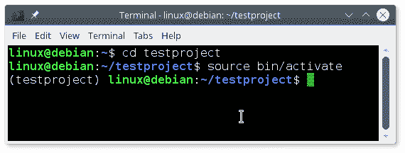
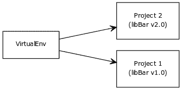

# 虚拟环境

> 原文： [https://pythonbasics.org/virtualenv/](https://pythonbasics.org/virtualenv/)

`virtualenv`可以创建隔离的 Python 环境。

Python 默认情况下在系统范围内安装模块。 如果程序需要同一模块的不同版本，则可能会成为问题。

这与其他未在系统范围内安装模块的编程语言不同。想象两个 Python 应用程序，其中一个需要 libBar 1.0，另一个需要 libBar 2.0。

`virtualenv`通过创建隔离的环境巧妙地解决了这个问题。 模块将仅安装在虚拟环境中。 在您的环境内部，您可以安装任何模块而不会影响系统范围的配置。


## 设置

程序`virtualenv`可以解决。 它使您可以创建虚拟环境。要创建虚拟环境，请使用以下命令：

```py
virtualenv -p python3 envname

```

其中`envname`是您的项目名称。 如果将项目命名为`testproject`，则会得到以下一行：

```py
virtualenv -p python3 testproject

```

这将使用以下子目录创建文件夹`virtualenv`：`bin`，`include`，`lib`和`share`。

加载虚拟环境类型

```py
cd testproject
bin/activate

```

现在，您的虚拟环境已激活。Shell 将显示当前已加载的虚拟环境。



要返回正常环境，请键入

```py
deactivate

```

您可以根据需要创建任意数量的虚拟环境。 每个项目都应该有自己的`virtualenv`，因为它需要不需要在系统范围内安装的特定模块。



## 练习

请尝试以下练习：

1.  为项目设置一个新的虚拟环境并激活它。 使用`pip`安装模块。

[下载示例](https://gum.co/HhgpI)