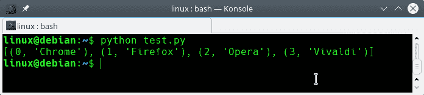

# 枚举

> 原文： [https://pythonbasics.org/enumerate/](https://pythonbasics.org/enumerate/)

枚举是一个内置函数，它返回一个枚举对象。

调用是`enumerate(sequence, start=0)`

输出对象包括一个计数器，如下所示：`(0, thing [0]), (1, thing [1]), (2, thing [2])`，依此类推。

作为输入，它需要一个类似于列表，元组或迭代器的序列。`start`参数是可选的。
如果起始参数设置为 1，则计数将从 1 开始而不是从 0 开始


## 枚举对象

创建一个序列并将其提供给枚举函数。 这可以是任何类型的序列，在此示例中，我们使用列表。 然后我们输出对象。

请尝试以下程序：

```py
# create a sequence
browsers = ['Chrome','Firefox','Opera','Vivaldi']

# create an enumeratable and convert to list
x = list(enumerate(browsers))
print(x)

```

您应该看到以下输出：



返回的对象可以像迭代器一样对待：下一个方法调用将起作用：

```py
browsers = ['Chrome','Firefox','Opera','Vivaldi']
eObj = enumerate(browsers)

x = next(eObj)
print(x)
x = next(eObj)
print(x)

```

## 练习

试试下面的练习

1.  将`for`循环与`enumerate`相结合。

[下载示例](https://gum.co/HhgpI)