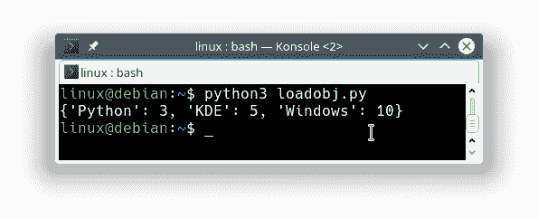

# Pickle

> 原文： [https://pythonbasics.org/pickle/](https://pythonbasics.org/pickle/)

Pickle 可用于序列化和反序列化对象。 可以将已序列化的对象保存并从磁盘加载。 Pickle 是一种将对象（列表，字典等）转换为文件，反之亦然的方法。

这个想法是在一个脚本中保存一个或多个对象，然后在另一个脚本中加载它们。 您也可以使用它来保存程序或游戏状态。

我们将使用二进制文件进行保存和加载，因为这样可以节省磁盘空间。


## 序列化对象

要使用 Pickle，请导入`pickle`模块。创建一个对象并将其序列化。 然后使用文件对象将其写入文件。

```py
import pickle

exampleObj = {'Python':3,'KDE':5,'Windows':10}

fileObj = open('data.obj', 'wb')
pickle.dump(exampleObj,fileObj)
fileObj.close()

```

## 反序列化对象

现在，该对象已保存到文件中，您可以加载它（解开它）。 在下面的示例中，我们从文件中加载对象。

加载`pickle`模块，打开然后读取文件，然后使用`pickle.load()`加载数据。 您可以将其加载到所需的任何变量中，但是为了方便起见，我使用了相同的名称（`exampleObj`）。

```py
import pickle   

fileObj = open('data.obj', 'rb')
exampleObj = pickle.load(fileObj)
fileObj.close()
print(exampleObj)

```

这将向您显示以前保存的对象：



## 练习

请尝试以下练习：

1.  从文件保存和加载对象
2.  尝试从文件加载多个对象

[下载示例](https://gum.co/HhgpI)