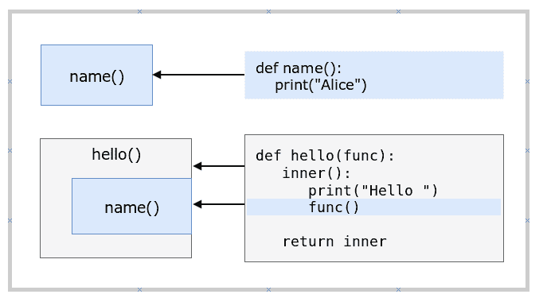
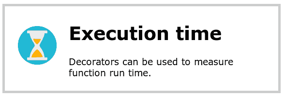
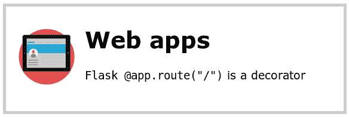

# 装饰器

> 原文： [https://pythonbasics.org/decorators/](https://pythonbasics.org/decorators/)

在本教程中学习 **Python 装饰器**。

使用装饰器向现有函数添加功能。 这称为元编程。

一个函数可以将一个函数作为参数（要修饰的函数），并返回带或不带扩展名的相同函数。

扩展函数有时非常有用，我们将在本文稍后展示真实的示例。


### 函数是对象

在 Python 中，一切都是对象，包括函数。 这意味着函数可以传递并返回。 当您看到它时，乍一看可能很奇怪：

```py
def hello():
    print("Hello")

# even functions are objects
message = hello

# call new function
message()

```

调用`message()`或`hello()`方法，它们具有相同的输出。 那是因为他们指的是同一个对象。

现在让我们继续装饰。

## 装饰器

### 示例

装饰器接受一个函数，对其进行扩展并返回。 是的，**函数可以返回函数**。

```py
def hello(func):
    def inner():
        print("Hello ")
		func()
    return inner

def name():
    print("Alice")

obj = hello(name)
obj()

```

在上面的示例中，`hello()`是装饰器。

在
语句中

```py
obj = hello(name)

```

函数`name()`由函数`hello()`装饰。

它将函数包装在另一个函数中。



### 示例 2

可以通过包装函数来扩展它们。

```py
def who():
    print("Alice")

def display(func):
    def inner():
        print("The current user is : ", end="")
        func()
    return inner

if __name__ == "__main__":
    myobj = display(who)
    myobj()

```

`who()`函数由`display()`装饰。

### 语法糖

装饰器是常见的，可以简化。 尽管功能完全相同，但代码更简洁。

Python 可以使用**`@`符号**简化装饰器的使用。

```py
@hello
def name():
    print("Alice")

if __name__ == "__main__":
    name()

```

这将输出完全相同的内容，但是是编写代码的更简洁的方法。

跟我在一起。调用：

```py
@hello
def name():

```

只是一种更简单的书写方式：

```py
obj = hello(name)

```

在这两种情况下，我们都将装饰器应用于函数。

### 参数

参数可以与装饰器一起使用。 如果您有一个打印总和`a + b`的函数，例如

```py
def sumab(a,b):
    summed = a + b
    print(summed)

```

您可以将其包装在装饰器函数中。以下示例显示了如何执行此操作：

```py
def pretty_sumab(func):
    def inner(a,b):
        print(str(a) + " + " + str(b) + " is ", end="")
        return func(a,b)

    return inner

@pretty_sumab
def sumab(a,b):
    summed = a + b
    print(summed)

if __name__ == "__main__":
    sumab(5,3)

```

函数`sumab`由函数`pretty_sumab`包装。 这用其上方的`@`符号表示。

调用函数`sumab`，并查看带有参数的函数`sumab`和`pretty_sumab`的逻辑都已运行。

### 真实示例

**用例：时间测量**



装饰器可用于测量函数执行所需的时间。

如果您定义了一个休眠的简单函数，则

```py
def myFunction(n):
  time.sleep(n)

```

然后，您只需添加`@measure_time`行即可测量所需的时间

下面的例子：

```py
import time

def measure_time(func):

  def wrapper(*arg):
      t = time.time()
      res = func(*arg)
      print("Function took " + str(time.time()-t) + " seconds to run")
      return res

  return wrapper

@measure_time
def myFunction(n):
  time.sleep(n)

if __name__ == "__main__":
    myFunction(2)

```

这将输出执行函数`myFunction()`所花费的时间。 很酷的事情是，通过添加一行代码`@measure_time`，我们现在可以测量程序执行时间。



**用例：Web 应用程序**

让我们以 Web 应用程序的使用案例为例。 在 Flask 中构建 Web 应用程序时，您始终会编写网址路由。

每个路由都是 Web 应用程序中的特定页面。打开页面`/about`可以调用`about_page()`方法。

```py
@app.route("/about")
def about_page():
  return "Website about nachos"

```

在这种情况下，它使用`@`符号进行装饰。

[下载示例和练习](https://gum.co/dcsp)