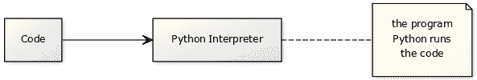
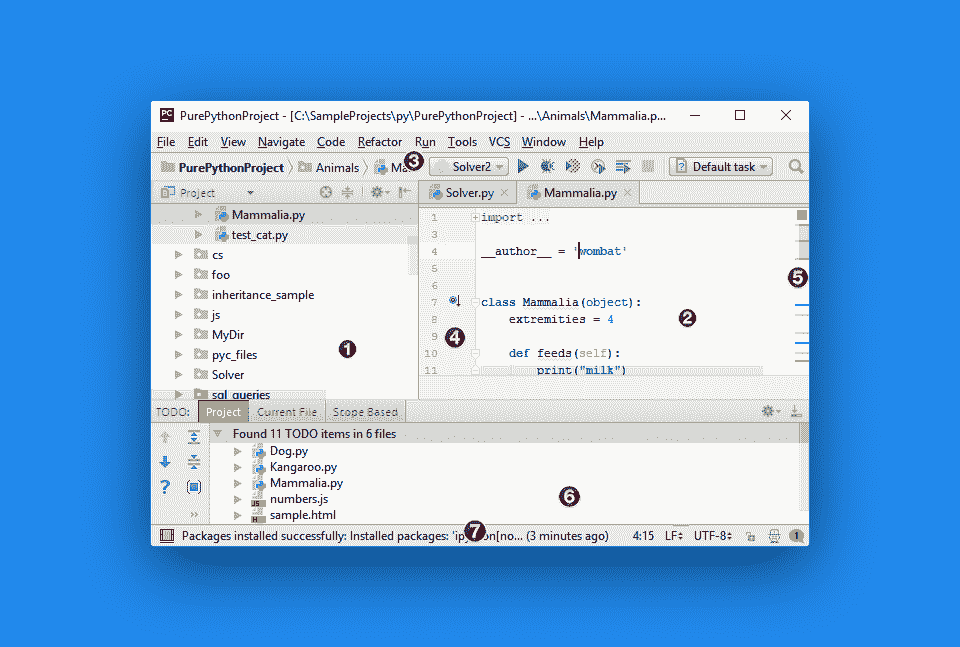

# 入门

> 原文： [https://pythonbasics.org/getting-started/](https://pythonbasics.org/getting-started/)

Python 是一种编程语言，语法简单易学。 Python 程序可以在所有台式计算机上运行。

它用于许多应用程序领域，包括：Web 和 Internet 开发，科学应用程序，桌面应用程序，教育和通用软件应用程序。


## Python 解释器

要运行 Python 程序，您将需要 Python 解释器和可能的图形编辑器。Python 解释器执行 Python 代码（有时称为程序）。



一个程序可以是一个或多个 Python 文件。 代码文件可以包括其他文件或模块。 要运行程序，需要在执行 Python 时指定一个参数。

## 运行 Python 代码

您可以在此处下载 Python 解释器： [https://www.python.org/downloads/](https://www.python.org/downloads/) 一旦安装了 Python 解释器，[请继续本教程](/execute-python-scripts/)。

要运行代码，请打开一个终端并启动：

```py

python file.py

```

该站点包含有关 Python 编程语言的练习。 如果您不熟悉编程，请先运行 Python 代码。

## Python IDE

IDE 是开发环境。 如果您不想在终端上工作，则可以使用 IDE。 这是一个图形编辑器，您可以在其中键入代码，使用多个文件，运行代码等。



在上面的 PyCharm IDE 中，您可以看到 1）文件菜单，2）代码，3）主菜单，4）行号，5）滚动条，6）文件和程序输出以及 7）其他信息。 大多数 IDE 具有这样的结构。

除非您是终端专家，否则 IDE 可以节省大量开发时间。 您可以快速处理多个文件，在项目之间切换以及在一个项目中与多个人一起工作。

一些流行的 Python IDE 是 [PyCharm](https://www.jetbrains.com/pycharm/) ， [PyDev](http://www.pydev.org/) 和 [Wing IDE](https://wingware.com/) 。