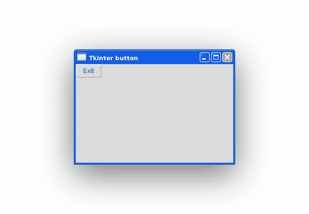

# Tkinter 按钮

> 原文： [https://pythonbasics.org/tkinter-button/](https://pythonbasics.org/tkinter-button/)

按钮是 GUI 中的标准小部件。 它们带有默认的 Tkinter 模块，您可以将它们放在窗口中。

Python 函数或方法可以与按钮关联。 该函数或方法称为回调函数。 如果单击该按钮，则会调用回调函数。

关于按钮的注释：tkinter 按钮只能显示单一字体的文本。 按钮文字可以是多行。 这意味着此小部件不会在文本旁边显示图标，因为您需要另一个小部件。


## 示例

### 简介

您可以使用以下几行创建并放置按钮：

```py
exitButton = Button(self, text="Exit", command=self.clickExitButton)
exitButton.place(x=0, y=0)

```

回调方法是`clickExitButton`，该方法在上一行（`command =`）中分配。这是一种简单的方法：

```py
def clickExitButton(self):
        exit()

```

如果没有回调方法，则会显示一个按钮，但是单击该按钮不会执行任何操作。

该窗口应显示：



### 按钮示例

要运行该示例，请将其另存为`button.py`并使用 python 解释器运行它。
此示例打开一个窗口，显示一个按钮，您可以单击该按钮。

```py
from tkinter import *

class Window(Frame):

    def __init__(self, master=None):
        Frame.__init__(self, master)        
        self.master = master

        # widget can take all window
        self.pack(fill=BOTH, expand=1)

        # create button, link it to clickExitButton()
        exitButton = Button(self, text="Exit", command=self.clickExitButton)

        # place button at (0,0)
        exitButton.place(x=0, y=0)

    def clickExitButton(self):
        exit()

root = Tk()
app = Window(root)
root.wm_title("Tkinter button")
root.geometry("320x200")
root.mainloop()

```

[下载 Tkinter 示例](https://gum.co/ErLc)