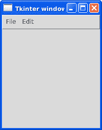

# Tkinter 菜单

> 原文： [https://pythonbasics.org/tkinter-menu/](https://pythonbasics.org/tkinter-menu/)

Tkinter 菜单是顶级下拉菜单。 正如您希望传统 gui 应用程序所期望的那样，它们显示在标题栏下方。

该菜单可以具有多个子菜单，并且每个子菜单都可以包含项目。 菜单项可以与回调方法相关联，这意味着单击它们时将调用 Python 方法。


## 示例

### 简介

添加菜单非常简单，但是如果您是第一次使用它，可能会有些混乱。 首先使用以下几行创建顶部菜单：

```py
self.master = master
menu = Menu(self.master)
self.master.config(menu=menu)

```

然后，您可以将菜单添加到此菜单：

```py
fileMenu = Menu(menu)
menu.add_cascade(label="File", menu=fileMenu)

editMenu = Menu(menu)
menu.add_cascade(label="Edit", menu=editMenu)

```

这些子菜单中的每个子菜单都可以包含以下项目：

```py
fileMenu.add_command(label="Item")
fileMenu.add_command(label="Exit", command=self.exitProgram)
editMenu.add_command(label="Undo")
editMenu.add_command(label="Redo")

```

菜单项可以单击，您可以按与按钮（`command =`）相同的方式指定回调方法。 单击后将调用 Python 方法。



### Tkinter 菜单示例

下面的菜单示例将菜单添加到基本的 tkinter 窗口。 它具有一个可单击的菜单项，但显示完整的菜单。

```py
from tkinter import *

class Window(Frame):
    def __init__(self, master=None):
        Frame.__init__(self, master)
        self.master = master

        menu = Menu(self.master)
        self.master.config(menu=menu)

        fileMenu = Menu(menu)
        fileMenu.add_command(label="Item")
        fileMenu.add_command(label="Exit", command=self.exitProgram)
        menu.add_cascade(label="File", menu=fileMenu)

        editMenu = Menu(menu)
        editMenu.add_command(label="Undo")
        editMenu.add_command(label="Redo")
        menu.add_cascade(label="Edit", menu=editMenu)

    def exitProgram(self):
        exit()

root = Tk()
app = Window(root)
root.wm_title("Tkinter window")
root.mainloop()

```

[下载 Tkinter 示例](https://gum.co/ErLc)