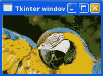

# Tkinter 图片

> 原文： [https://pythonbasics.org/tkinter-image/](https://pythonbasics.org/tkinter-image/)

图像可以用 Tkinter 显示。 图像可以采用多种格式，包括 jpeg 图像。 有点违反直觉，但是您可以使用标签显示图像。

要打开图像，请使用`Image.open(filename)`方法。 这将在程序目录中查找图像，对于其他目录，将路径添加到文件名。


## 示例

### 简介

本示例加载并在标签上显示图像。 就像在 Tkinter 窗口上显示文本一样简单，但是我们显示的是图像而不是文本。

您应该安装 Python 图像库（PIL）来加载图像。 这是必需的，并且该模块在 PyPi 中可用。 使用 pip 软件包管理器安装该模块。

它可以打开各种图像格式，包括 PPM，PNG，JPEG，GIF，TIFF 和 BMP。

加载图像：

```py
load = Image.open("parrot.jpg")
render = ImageTk.PhotoImage(load)

```

然后将其与标签关联：

```py
img = Label(self, image=render)
img.image = render
img.place(x=0, y=0)

```



### Tkinter 图像示例

您可以打开一个窗口，添加标签并将图像与之关联。 在此示例中，我们加载 jpeg 图像，但是您可以加载任何图像。

下面是一个完整的示例：

```py
from tkinter import *

# pip install pillow
from PIL import Image, ImageTk

class Window(Frame):
    def __init__(self, master=None):
        Frame.__init__(self, master)
        self.master = master
        self.pack(fill=BOTH, expand=1)

        load = Image.open("parrot.jpg")
        render = ImageTk.PhotoImage(load)
        img = Label(self, image=render)
        img.image = render
        img.place(x=0, y=0)

root = Tk()
app = Window(root)
root.wm_title("Tkinter window")
root.geometry("200x120")
root.mainloop()

```

[下载 Tkinter 示例](https://gum.co/ErLc)