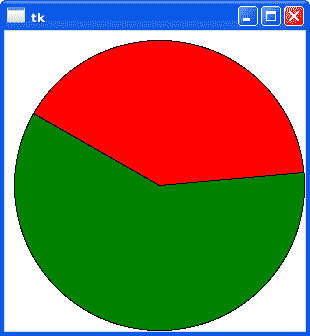

# Tkinter 画布

> 原文： [https://pythonbasics.org/tkinter-canvas/](https://pythonbasics.org/tkinter-canvas/)

Tkinter 画布可用于在窗口中绘制。 使用此小部件可以绘制图形或绘图。 您甚至可以使用它来创建图形编辑器。

您可以在画布上绘制几个小部件：弧形，图像，直线，矩形，文本，切片，椭圆形，多边形，椭圆形，多边形和矩形。 矩形可以是轮廓，也可以是内部。

画布具有两个坐标系：窗口系统（左上角`x = 0`，`y = 0`）和定义项目绘制位置的画布坐标系。


## 示例

### 简介

画布是一个通用的小部件：您可以使用它来制作任何类型的图形，包括绘图，绘图，图表，显示图像等等。

画布添加了一行代码：

```py
myCanvas = tkinter.Canvas(root, bg="white", height=300, width=300)

```

这定义了添加位置，背景和大小。 创建后，您可以在其顶部进行绘制。

如果要绘制弧，只需调用其方法`create_arc()`：

```py
arc = myCanvas.create_arc(coord, start=0, extent=150, fill="red")

```



### Tkinter 画布

将画布添加到 TK 窗口并在其中进行绘制非常容易。此示例打开一个窗口，添加一个画布并在其中绘制两个弧线。 该程序将绘制两个弧，一个绿色的弧和一个红色的弧，它们共同构成一个圆。

```py
import tkinter

# init tk
root = tkinter.Tk()

# create canvas
myCanvas = tkinter.Canvas(root, bg="white", height=300, width=300)

# draw arcs
coord = 10, 10, 300, 300
arc = myCanvas.create_arc(coord, start=0, extent=150, fill="red")
arv2 = myCanvas.create_arc(coord, start=150, extent=215, fill="green")

# add to window and show
myCanvas.pack()
root.mainloop()

```

[下载 Tkinter 示例](https://gum.co/ErLc)