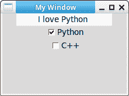

# Tkinter 复选框

> 原文： [https://pythonbasics.org/tkinter_checkbox/](https://pythonbasics.org/tkinter_checkbox/)

复选框小部件非常明显，您根本无需考虑它们。 它们就像开/关开关，您可以有多个开关。 它是 Tkinter 中包含的小部件之一。

如果您希望单击零个或多个选项，则可以使用一个复选框。 否则，您将使用单选按钮或其他类型的按钮。


## 复选框

### Tkinter 复选框

Tkinter 复选框小部件是一个非常基本的开关。 Tkinter 中的复选框称为`CheckButton`。 您可以添加两个复选框，如下所示：

```py
c1 = tk.Checkbutton(window, text='Python',variable=var1, onvalue=1, offvalue=0, command=print_selection)
c1.pack()
c2 = tk.Checkbutton(window, text='C++',variable=var2, onvalue=1, offvalue=0, command=print_selection)
c2.pack()

```

### 示例

下面的程序在窗口中添加了几个检查按钮。 如果单击复选框，则上面的文本会更改。

```py
#!/usr/bin/env python
# -*- coding: utf-8 -*-

import tkinter as tk

window = tk.Tk()
window.title('My Window')
window.geometry('100x100')

l = tk.Label(window, bg='white', width=20, text='empty')
l.pack()

def print_selection():
    if (var1.get() == 1) & (var2.get() == 0):
        l.config(text='I love Python ')
    elif (var1.get() == 0) & (var2.get() == 1):
        l.config(text='I love C++')
    elif (var1.get() == 0) & (var2.get() == 0):
        l.config(text='I do not anything')
    else:
        l.config(text='I love both')

var1 = tk.IntVar()
var2 = tk.IntVar()
c1 = tk.Checkbutton(window, text='Python',variable=var1, onvalue=1, offvalue=0, command=print_selection)
c1.pack()
c2 = tk.Checkbutton(window, text='C++',variable=var2, onvalue=1, offvalue=0, command=print_selection)
c2.pack()

window.mainloop()

```



[下载 Tkinter 示例](https://gum.co/ErLc)