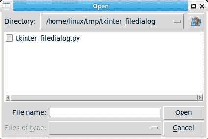

# Tkinter 文件对话框

> 原文： [https://pythonbasics.org/tkinter_filedialog/](https://pythonbasics.org/tkinter_filedialog/)

文件对话框可帮助您打开，保存文件或目录。 这是单击文件后打开的对话框的类型。 该对话框来自模块，无需手动编写所有代码。

Tkinter 没有本机外观的文件对话框，而是具有客户 TK 样式。 您可以在下面看到这些。

文件对话框将在所有桌面平台上运行。


## 文件对话框

### Tkinter 文件对话框

Tkinter 文件对话框有几种类型。 您真正需要哪种类型取决于您的应用程序需求。 它们都是方法调用。

您可以打开一个文件，一个目录，另存为文件等等。

```py
import tkinter.filedialog

tkinter.filedialog.asksaveasfilename()
tkinter.filedialog.asksaveasfile()
tkinter.filedialog.askopenfilename()
tkinter.filedialog.askopenfile()
tkinter.filedialog.askdirectory()
tkinter.filedialog.askopenfilenames()
tkinter.filedialog.askopenfiles()

```



[下载 Tkinter 示例](https://gum.co/ErLc)