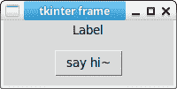
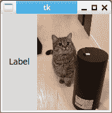
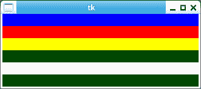

# Tkinter 框架

> 原文： [https://pythonbasics.org/tkinter_frame/](https://pythonbasics.org/tkinter_frame/)

Tk 中的框架可让您组织和分组小部件。 它像一个容器一样工作。 它是可以放置遗物的矩形区域。

如果您制作的是 GUI 应用，则将使用其他小部件。 这些小部件需要以某种方式进行组织，这就是框架的来源。


### Tkinter 框架按钮

下面的 Tkinter 程序演示了框架的使用。 它包括带有回调函数的按钮。 框架可以有填充。

```py
from tkinter import *

def say_hi():
    print("hello ~ !")

root = Tk()

frame1 = Frame(root)
frame2 = Frame(root)
root.title("tkinter frame")

label= Label(frame1,text="Label",justify=LEFT)
label.pack(side=LEFT)

hi_there = Button(frame2,text="say hi~",command=say_hi)
hi_there.pack()

frame1.pack(padx=1,pady=1)
frame2.pack(padx=10,pady=10)

root.mainloop()

```



### Tkinter 框架照片

可以添加不同类型的小部件。 该示例具有 Tkinter 框架照片。 它还有一个标签。 您可以向框架添加任何类型的小部件。

```py
from tkinter import *

root = Tk()

textLabel = Label(root,
                  text="Label",
                  justify=LEFT,
                  padx=10)
textLabel.pack(side=LEFT)

photo = PhotoImage(file="cat.png")
imgLabel = Label(root, image=photo)
imgLabel.pack(side=RIGHT)

mainloop()

```



### Tkinter 框架

下面的 Tkinter 程序添加了不同颜色的多个框架。 它们都具有相同的宽度和高度。 换句话说，您可以更改框架的样式。

```py
from tkinter import *  
root = Tk()  

for fm in ['blue','red','yellow','green','white','black']:  
    Frame(height = 20,width = 640,bg = fm).pack()  
root.mainloop() 

```



[下载 Tkinter 示例](https://gum.co/ErLc)