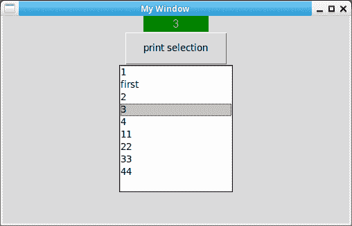

# Tkinter 列表框

> 原文： [https://pythonbasics.org/tkinter_listbox/](https://pythonbasics.org/tkinter_listbox/)

列表框显示选项列表。 然后，您可以单击任何这些选项。 默认情况下，它不会执行任何操作，但是您可以将其链接到回调函数或单击按钮。

要添加新项目，可以使用`insert()`方法。 这接受单个参数或项目列表。


### Tkinter 列表框

如果您有多个项目，则可以使用列表框。 下面的 Tkinter 列表框示例显示了不同的项目。 这是一个交互式程序，您可以单击并更改值。

这不是组合框，请参见下面的屏幕截图。

```py
#!/usr/bin/env python
# -*- coding: utf-8 -*-

import tkinter as tk

window = tk.Tk()
window.title('My Window')

window.geometry('500x300')

var1 = tk.StringVar()
l = tk.Label(window, bg='green', fg='yellow',font=('Arial', 12), width=10, textvariable=var1)
l.pack()

def print_selection():
    value = lb.get(lb.curselection())   
    var1.set(value)  

b1 = tk.Button(window, text='print selection', width=15, height=2, command=print_selection)
b1.pack()

var2 = tk.StringVar()
var2.set((1,2,3,4))
lb = tk.Listbox(window, listvariable=var2)

list_items = [11,22,33,44]
for item in list_items:
    lb.insert('end', item)
lb.insert(1, 'first')
lb.insert(2, 'second')
lb.delete(2)
lb.pack()

window.mainloop()

```



[下载 Tkinter 示例](https://gum.co/ErLc)