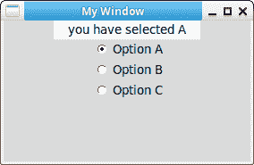

# Tkinter 单选按钮

> 原文： [https://pythonbasics.org/tkinter_radiobutton/](https://pythonbasics.org/tkinter_radiobutton/)

单选按钮使您可以从各种项目中进行选择。 它们是默认 TK 模块的一部分。 与复选框不同，Tkinter 仅允许您选择一个选项。

您可以通过为单选按钮添加与参数相同的变量来实现。 如果单击单选按钮，则可以调用回调函数。


## 单选按钮

### Tkinter 单选按钮

下面的程序使用方法`Radiobutton`创建 3 个单选按钮。 它添加了一个窗口作为参数，文本，与之连接的变量以及回调函数。

为了使它起作用，所有单选按钮都需要链接到相同的变量，在此示例中为`var`。

```py
#!/usr/bin/env python
# -*- coding: utf-8 -*-

import tkinter as tk

window = tk.Tk()
window.title('My Window')
window.geometry('500x300')

var = tk.StringVar()
l = tk.Label(window, bg='white', width=20, text='empty')
l.pack()

def print_selection():
    l.config(text='you have selected ' + var.get())

r1 = tk.Radiobutton(window, text='Option A', variable=var, value='A', command=print_selection)
r1.pack()
r2 = tk.Radiobutton(window, text='Option B', variable=var, value='B', command=print_selection)
r2.pack()
r3 = tk.Radiobutton(window, text='Option C', variable=var, value='C', command=print_selection)
r3.pack()

window.mainloop()

```



[下载 Tkinter 示例](https://gum.co/ErLc)