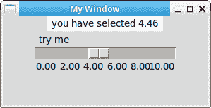

# Tkinter 刻度

> 原文： [https://pythonbasics.org/tkinter_scale/](https://pythonbasics.org/tkinter_scale/)

您可以在窗口中添加刻度或滑块。 您可能通过音量控制对此很熟悉。 它可以是水平滑块或垂直滑块。

刻度具有您可以定义的最小值和最大值。 您可以设置移动滑块时调用的回调函数。


## 刻度

### Tkinter 刻度

下面的 Tkinter 程序将创建一个刻度。 您可以定义最小值（`from_`）和最大值（`to`）。 要更改其方向，请更改`orient`参数。

`tickinterval`是您要设置的（如果不同于）。 您还可以设置其长度。

```py
#!/usr/bin/env python
# -*- coding: utf-8 -*-

import tkinter as tk

window = tk.Tk()
window.title('My Window')
window.geometry('500x300') 

l = tk.Label(window, bg='white', fg='black', width=20, text='empty')
l.pack()

def print_selection(v):
    l.config(text='you have selected ' + v)

s = tk.Scale(window, label='try me', from_=0, to=10, orient=tk.HORIZONTAL, length=200, showvalue=0,tickinterval=2, resolution=0.01, command=print_selection)
s.pack()

window.mainloop()

```



[下载 Tkinter 示例](https://gum.co/ErLc)