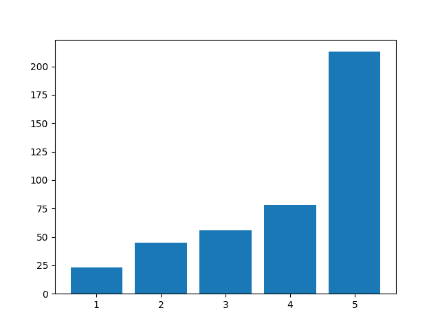
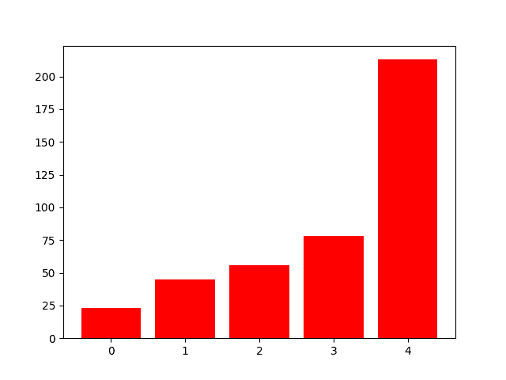
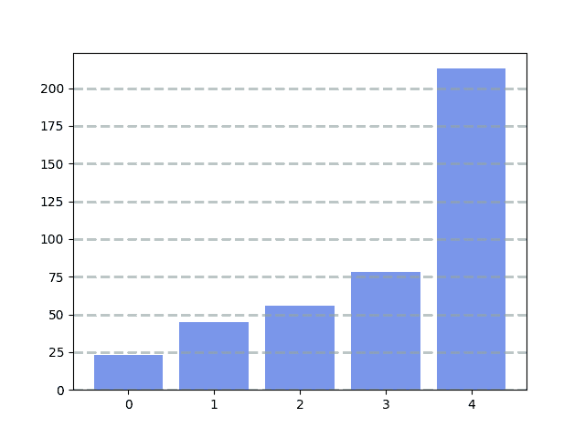
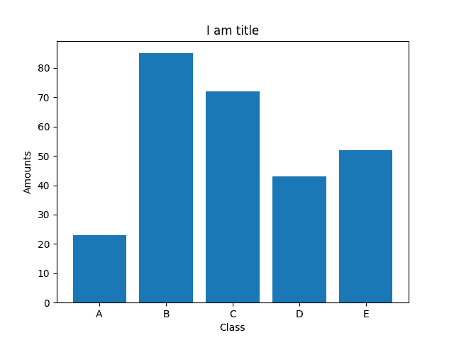
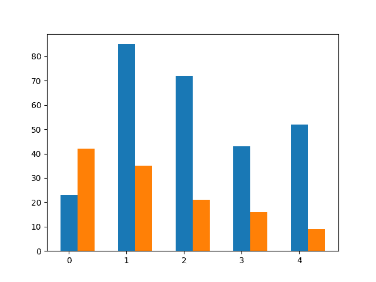
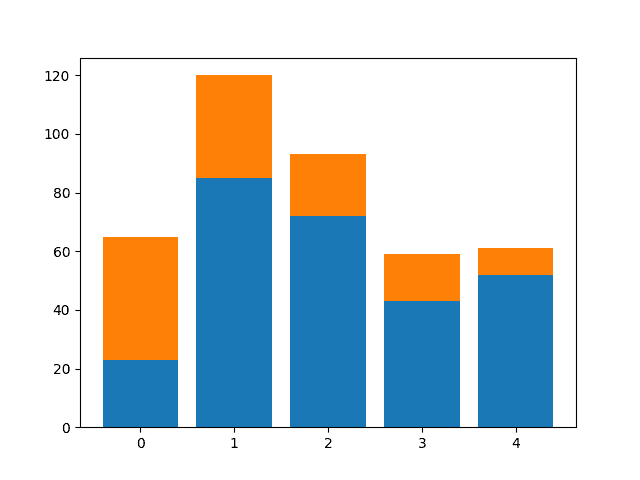

# Matplotlib 条形图

> 原文： [https://pythonbasics.org/matplotlib-bar-chart/](https://pythonbasics.org/matplotlib-bar-chart/)

条形图可以使用 Matplotlib 制作。 您可以创建各种颜色，位置，方向等变化的变体。 那么什么是 Matplotlib？

Matplotlib 是一个 Python 模块，可让您绘制各种图表。 条形图是可以绘制的图表类型之一。 条形图有许多不同的变体。


## 示例

### 条形图

`bar()`方法创建一个条形图。 那么您如何使用它呢？下面的程序创建一个条形图。 我们向它提供水平和垂直（数据）数据。

```py
#!/usr/bin/python3
import numpy as np
import pandas as pd
from pandas import Series, DataFrame
import matplotlib.pyplot as plt

data = [23, 45, 56, 78, 213]
plt.bar([1,2,3,4,5], data)
plt.show()

```



### 绘图颜色

您可以更改条形图的颜色。 为此，只需添加`color`参数。可以将参数设置为英语颜色定义，例如`'red'`。

例：

```py
import numpy as np
import pandas as pd
from pandas import Series, DataFrame
import matplotlib.pyplot as plt

data = [23, 45, 56, 78, 213]
plt.bar(range(len(data)), data, color='red')
plt.show()

```



[下载 matplotlib 示例](https://gum.co/mpdp)

### 网格线

如果需要网格线，则可以这样做。 函数`.grid()`具有颜色，线型，宽度和轴。 （可选）您可以添加一个`alpha`值。

像这样的代码：

```py
import numpy as np
import pandas as pd
from pandas import Series, DataFrame
import matplotlib.pyplot as plt

data = [23, 45, 56, 78, 213]

plt.bar(range(len(data)), data, color='royalblue', alpha=0.7)
plt.grid(color='#95a5a6', linestyle='--', linewidth=2, axis='y', alpha=0.7)
plt.show()

```



[下载 matplotlib 示例](https://gum.co/mpdp)

### Matplotlib 标签

绘图需要描述。 如果观看者不知道数字代表什么，那么绘图的用途是什么。 您要添加标签吗？

下面的代码将标签添加到绘图中。

```py
import numpy as np
import pandas as pd
from pandas import Series, DataFrame
import matplotlib.pyplot as plt

data = [23,85, 72, 43, 52]
labels = ['A', 'B', 'C', 'D', 'E']
plt.xticks(range(len(data)), labels)
plt.xlabel('Class')
plt.ylabel('Amounts')
plt.title('I am title')
plt.bar(range(len(data)), data) 
plt.show()

```



### 多个图表

您可以在一个图中绘制多个条形图。 需要多个条形图？

下面的代码通过两次调用该方法来添加两个`bar`绘图。 指定了宽度参数。

```py
import numpy as np
import pandas as pd
from pandas import Series, DataFrame
import matplotlib.pyplot as plt

data1 = [23,85, 72, 43, 52]
data2 = [42, 35, 21, 16, 9]
width =0.3
plt.bar(np.arange(len(data1)), data1, width=width)
plt.bar(np.arange(len(data2))+ width, data2, width=width)
plt.show()

```



### 堆叠图

您可以将条形图彼此堆叠。 当您将多个值组合成更大的值时，这特别有用。

```py
import numpy as np
import pandas as pd
from pandas import Series, DataFrame
import matplotlib.pyplot as plt

data1 = [23,85, 72, 43, 52]
data2 = [42, 35, 21, 16, 9]
plt.bar(range(len(data1)), data1)
plt.bar(range(len(data2)), data2, bottom=data1)
plt.show()

```

