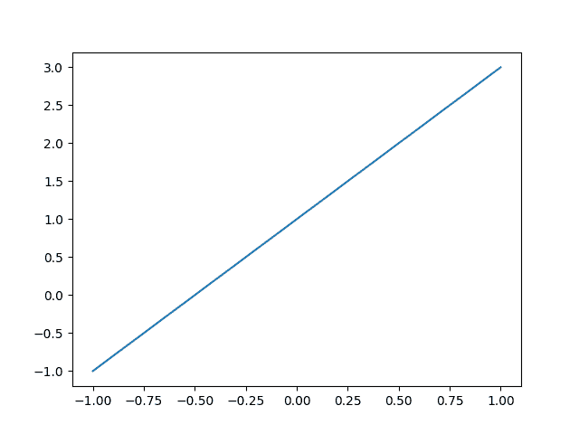
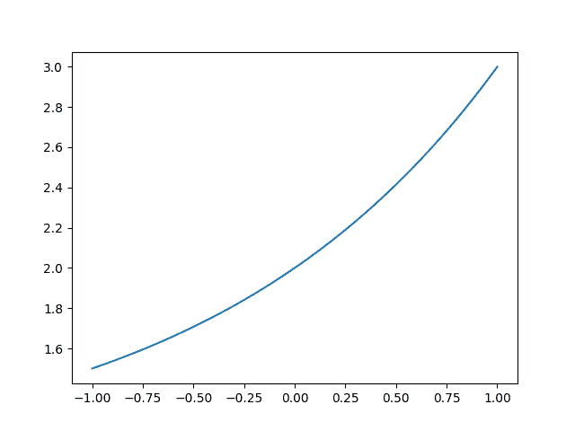
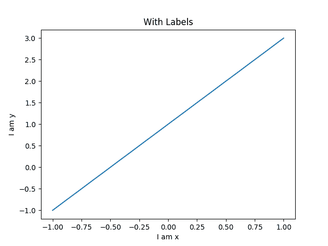
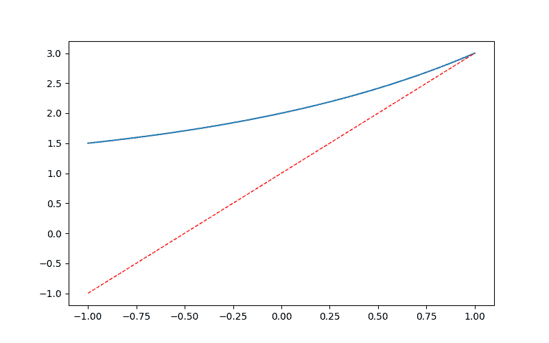
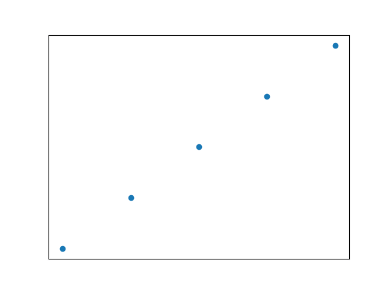
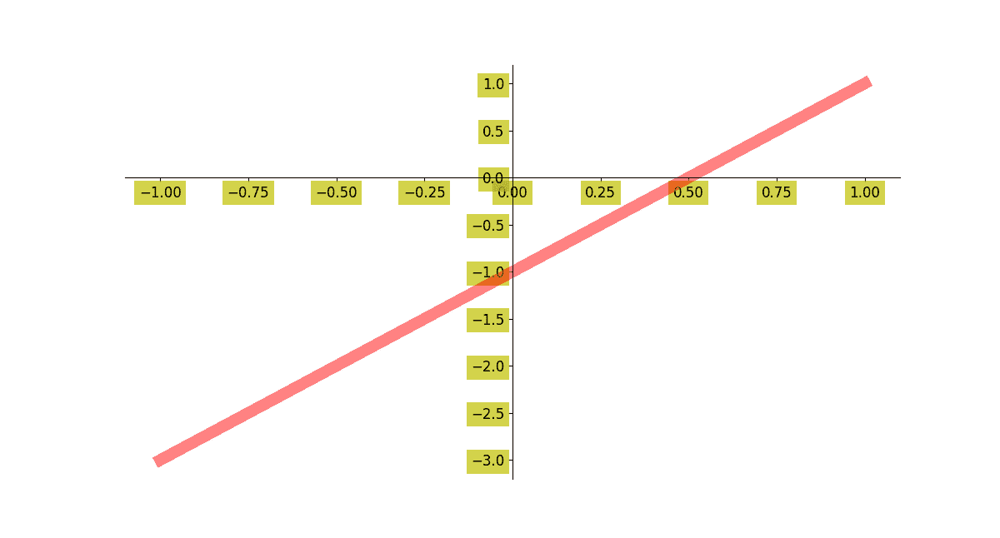
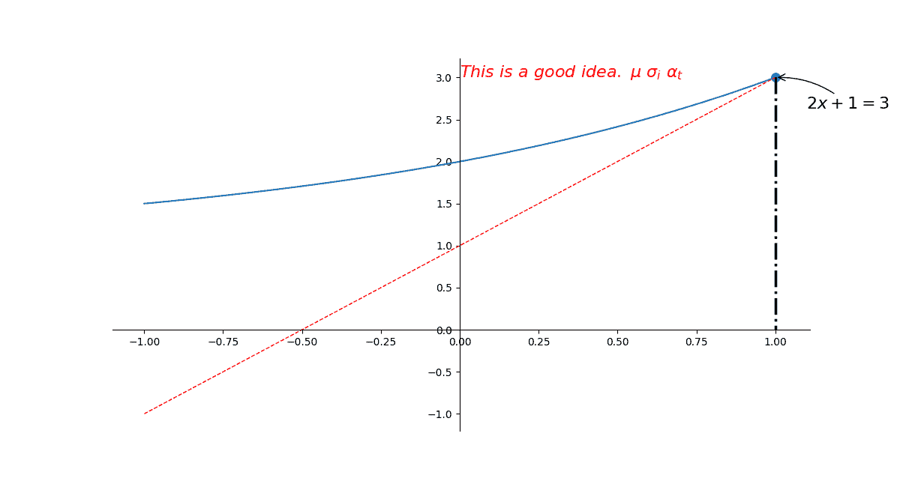
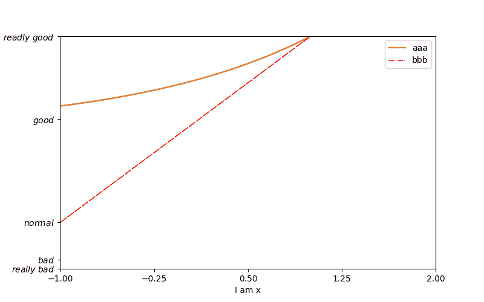

# Matplotlib 折线图

> 原文： [https://pythonbasics.org/matplotlib-line-chart/](https://pythonbasics.org/matplotlib-line-chart/)

折线图使用 Matplotlib 开箱即用。 折线图中可以包含多条折线，更改颜色，更改折线类型等等。

Matplotlib 是用于绘图的 Python 模块。 折线图是它可以创建的多种图表类型之一。


## 折线图示例

### 折线图

首先导入`matplotlib`和`numpy`，它们对于制图非常有用。
您可以使用`plot(x, y)`方法创建折线图。

```py
import matplotlib.pyplot as plt
import numpy as np

x = np.linspace(-1, 1, 50)
print(x)
y = 2*x + 1

plt.plot(x, y)
plt.show()

```



### 曲线

`plot()`方法也适用于其他类型的折线图。 不需要是直线，`y`可以具有任何类型的值。

```py
import matplotlib.pyplot as plt
import numpy as np

x = np.linspace(-1, 1, 50)
y = 2**x + 1

plt.plot(x, y)  
plt.show()

```



[下载示例](https://gum.co/mpdp)

### 带有标签的直线

要知道您在看什么，您需要元数据。 标签是一种元数据。 它们显示图表的内容。 图表具有`x`标签，`y`标签和标题。

```py
import matplotlib.pyplot as plt
import numpy as np

x = np.linspace(-1, 1, 50)
y1 = 2*x + 1
y2 = 2**x + 1

plt.figure()
plt.plot(x, y1)  

plt.xlabel("I am x")
plt.ylabel("I am y")
plt.title("With Labels")

plt.show()

```



### 多个直线

绘图中可以有多条线。 要添加另一行，只需再次调用`plot(x, y)`函数。 在下面的示例中，我们在图表上绘制了`y(y1, y2)`的两个不同值。

```py
import matplotlib.pyplot as plt
import numpy as np

x = np.linspace(-1, 1, 50)
y1 = 2*x + 1
y2 = 2**x + 1

plt.figure(num = 3, figsize=(8, 5))
plt.plot(x, y2)
plt.plot(x, y1, 
         color='red',   
         linewidth=1.0,  
         linestyle='--' 
        )

plt.show()

```



### 虚线

线可以是点的形式，如下图所示。 调用`scatter(x, y)`方法而不是调用`plot(x, y)`。`scatter(x, y)`方法还可以用于（随机）将点绘制到图表上。

```py
import matplotlib.pyplot as plt
import numpy as np

n = 1024
X = np.random.normal(0, 1, n)
Y = np.random.normal(0, 1, n)
T = np.arctan2(X, Y)

plt.scatter(np.arange(5), np.arange(5))

plt.xticks(())
plt.yticks(())

plt.show()

```



[下载示例](https://gum.co/mpdp)

### 直线刻度

您可以更改绘图上的刻度。 将它们设置在`x`轴，`y`轴上，甚至更改其颜色。 这条线可以更粗并且具有`alpha`值。

```py
import matplotlib.pyplot as plt
import numpy as np

x = np.linspace(-1, 1, 50)
y = 2*x - 1

plt.figure(figsize=(12, 8)) 
plt.plot(x, y, color='r', linewidth=10.0, alpha=0.5)

ax = plt.gca()

ax.spines['right'].set_color('none')
ax.spines['top'].set_color('none')

ax.xaxis.set_ticks_position('bottom')
ax.yaxis.set_ticks_position('left')

ax.spines['bottom'].set_position(('data', 0))
ax.spines['left'].set_position(('data', 0))

for label in ax.get_xticklabels() + ax.get_yticklabels():
    label.set_fontsize(12)
    label.set_bbox(dict(facecolor='y', edgecolor='None', alpha=0.7))

plt.show()

```



### 渐近线

可以将渐近线添加到该图。 为此，请使用`plt.annotate()`。 在下面的图中还有一条虚线。 您可以试一下代码以查看其工作原理。

```py
import matplotlib.pyplot as plt
import numpy as np

x = np.linspace(-1, 1, 50)
y1 = 2*x + 1
y2 = 2**x + 1

plt.figure(figsize=(12, 8))  
plt.plot(x, y2)
plt.plot(x, y1, color='red', linewidth=1.0, linestyle='--')

ax = plt.gca()

ax.spines['right'].set_color('none')
ax.spines['top'].set_color('none')

ax.xaxis.set_ticks_position('bottom')
ax.yaxis.set_ticks_position('left')

ax.spines['bottom'].set_position(('data', 0))
ax.spines['left'].set_position(('data', 0))

x0 = 1
y0 = 2*x0 + 1

plt.scatter(x0, y0, s = 66, color = 'b')
plt.plot([x0, x0], [y0, 0], 'k-.', lw= 2.5)

plt.annotate(r'$2x+1=%s$' % 
             y0, 
             xy=(x0, y0), 
             xycoords='data',

             xytext=(+30, -30),
             textcoords='offset points',
             fontsize=16,  
             arrowprops=dict(arrowstyle='->',connectionstyle='arc3,rad=.2')
            )

plt.text(0, 3, 
         r'$This\ is\ a\ good\ idea.\ \mu\ \sigma_i\ \alpha_t$',
         fontdict={'size':16,'color':'r'})

plt.show()

```



### 带有文字刻度的直线

不一定是数字刻度。 秤也可以包含文字，例如以下示例。 在`plt.yticks()`中，我们只传递一个带有文本值的列表。 然后将这些值显示在`y`轴上。

```py
import matplotlib.pyplot as plt
import numpy as np

x = np.linspace(-1, 1, 50)
y1 = 2*x + 1
y2 = 2**x + 1

plt.figure(num = 3, figsize=(8, 5))  
plt.plot(x, y2)

plt.plot(x, y1, 
         color='red',  
         linewidth=1.0,  
         linestyle='--'  
        )

plt.xlim((-1, 2))  
plt.ylim((1, 3))  

new_ticks = np.linspace(-1, 2, 5)
plt.xticks(new_ticks)
plt.yticks([-2, -1.8, -1, 1.22, 3],
          [r'$really\ bad$', r'$bad$', r'$normal$', r'$good$', r'$readly\ good$'])

ax = plt.gca()
ax.spines['right'].set_color('none')
ax.spines['top'].set_color('none')

ax.xaxis.set_ticks_position('bottom')
ax.yaxis.set_ticks_position('left')

ax.spines['bottom'].set_position(('data', 0))
ax.spines['left'].set_position(('data', 0))

plt.show()

```

