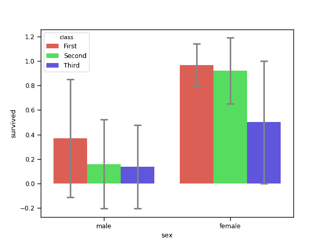
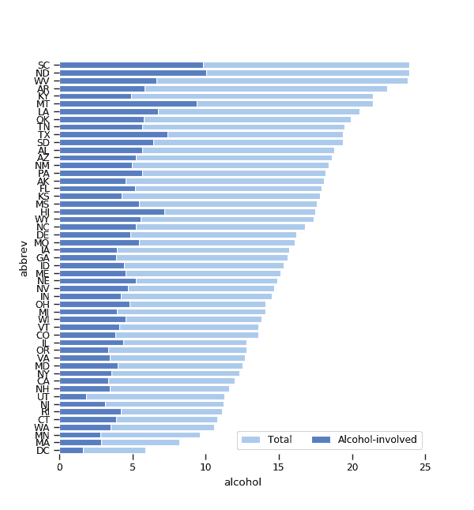
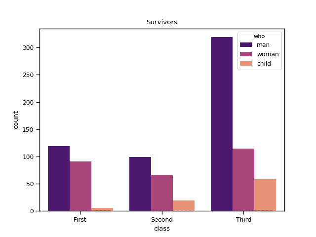

# Seaborn 绘图

> 原文： [https://pythonbasics.org/seaborn_barplot/](https://pythonbasics.org/seaborn_barplot/)

Seaborn 支持多种类型的条形图。 我们将 Seaborn 与 Matplotlib 结合起来演示了几个绘图。

Seaborn 包含几个数据集（titanic 和其他），但这只是一个演示。 您可以将任何类型的数据传递到绘图。


## 条形图示例

### 条形图

用`barplot()`方法创建一个条形图。 下面的条形图根据类别显示了泰坦尼克号撞车事故的幸存者。 您会看到这些条形图随着船沉没而下降:)

调色板参数定义了要使用的颜色，当前使用的是`"hls"`，但可以使用任何调色板。

```py
import numpy as np
import pandas as pd
import matplotlib.pyplot as plt
import seaborn as sns

sns.set_context('paper')

# load dataset
titanic = sns.load_dataset('titanic')
print(titanic.head())

# create plot
sns.barplot(x = 'sex', y = 'survived', hue = 'class', data = titanic,
            palette = 'hls',
            order = ['male', 'female'],  
            capsize = 0.05,             
            saturation = 8,             
            errcolor = 'gray', errwidth = 2,  
            ci = 'sd'   
            )

print(titanic.groupby(['sex', 'class']).mean()['survived'])
print(titanic.groupby(['sex', 'class']).std()['survived'])

plt.show()

```



### 水平条形图

该条形图可以是使用`barplot()`方法的水平图。 在下面的示例中，两个条形图是重叠的，显示了百分比作为总崩溃的一部分。

```py
import numpy as np
import pandas as pd
import matplotlib.pyplot as plt
import seaborn as sns

sns.set_context('paper')

crashes = sns.load_dataset('car_crashes').sort_values('total', ascending = False)
f, ax = plt.subplots(figsize = (6,15))
sns.set_color_codes('pastel')
sns.barplot(x = 'total', y = 'abbrev', data = crashes,
            label = 'Total', color = 'b', edgecolor = 'w')
sns.set_color_codes('muted')
sns.barplot(x = 'alcohol', y = 'abbrev', data = crashes,
            label = 'Alcohol-involved', color = 'b', edgecolor = 'w')
ax.legend(ncol = 2, loc = 'lower right')
sns.despine(left = True, bottom = True)
plt.show()

```



### 条形图提示

下面的条形图提示图使用提示数据集。 它显示了根据性别收到的提示数量。 它使用蓝调调色板，该调色板具有蓝色的变体。

```py
import numpy as np
import pandas as pd
import matplotlib.pyplot as plt
import seaborn as sns

sns.set_context('paper')

tips = sns.load_dataset('tips')
sns.barplot(x = 'day', y = 'total_bill', hue = 'sex', data = tips,
            palette = 'Blues', edgecolor = 'w')
tips.groupby(['day','sex']).mean()

plt.show()

```


### 计数图

可以将计数图视为跨类别变量的直方图。下面的示例演示了计数图。

```py
import numpy as np
import pandas as pd
import matplotlib.pyplot as plt
import seaborn as sns

sns.set_context('paper')

# load dataset
titanic = sns.load_dataset('titanic')
print(titanic.head())

# create plot
sns.countplot(x = 'class', hue = 'who', data = titanic, palette = 'magma')
plt.title('Survivors')
plt.show()

```

