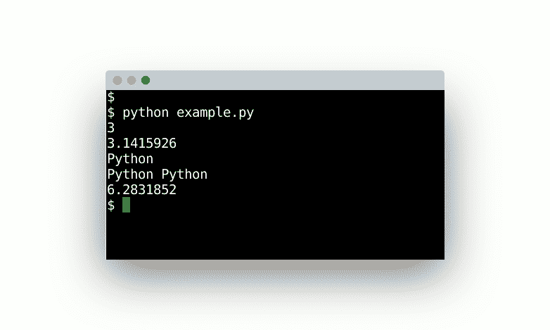

# 变量

> 原文： [https://pythonbasics.org/variables/](https://pythonbasics.org/variables/)

Python 支持不同类型的变量（数据类型），例如整数，浮点数和文本。

您无需指定变量的数据类型，只需将任何值分配给变量即可。 在下面键入程序并启动它。


## 数据类型

变量可以是几种数据类型。 Python 支持整数（数字），浮点数，布尔值（对或错）和字符串（文本）。

Python 将根据您分配给变量的值来确定数据类型。 如果创建变量`x`，`x = 3`，则 Python 假定其为整数。 但是，如果您指定`x = 1.5`，则 Python 知道其不是整数，而是浮点数。

## 示例

下面的示例向您展示了几个变量。 这些可以根据需要分配。 定义后，您可以打印它们或使用算术。

```py
#!/usr/bin/python

x = 3              # a whole number                   
f = 3.1415926      # a floating point number              
name = "Python"    # a string

print(x)
print(f)
print(name)

combination = name + " " + name
print(combination)

sum = f + f
print(sum)

```

从终端或使用 IDE 运行程序。

```py
python example.py

```

在示例中，我们有几个变量（`x`，`f`，`name`），它们具有不同的数据类型。 在程序的后面，我们创建更多的变量（`combination`，`sum`）。

可以在程序中的任何位置定义变量。 变量名可以是 1 到 n 个字母。

您应该看到几行包含数字和文本的行：



### 命名

变量名必须以字母（大写或小写）或下划线开头。 变量不能以数字开头，并且区分大小写。

如果创建两个变量`x`和`X`，则它们是不同的变量。

```py
Python 3.5.3 (default, Jan 19 2017, 14:11:04)
[GCC 6.3.0 20170118] on linux
Type "help", "copyright", "credits" or "license" for more information.
>>> x = 3
>>> X = 4
>>> print(x)
3
>>> print(X)
4
>>>

```

### 驼峰大小写

按照惯例，变量通常用驼峰大小写，这意味着第一个字母较小，接下来的单词全为大写。

一些使用驼峰大小写的示例变量

```py
daysInYear = 365
daysInMonth = 30
numberFiles = 5

```

这比拥有一个长变量（`dayinyear`）更容易阅读。 但这不是 Python 的严格要求。

## 练习

试试下面的练习

1.  制作一个显示几个数字的程序。
2.  编写一个程序来解决并显示`64 + 32`的总和。
3.  进行与 2 中相同的操作，但将其计算`x + y`。

完成这些步骤后，继续下一个练习。

[下载示例](https://gum.co/dcsp)