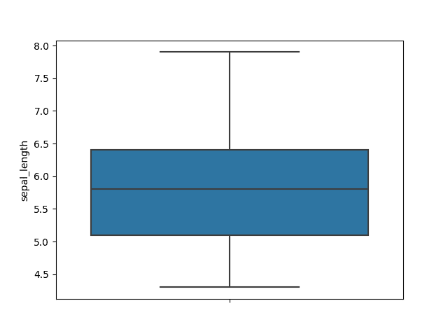
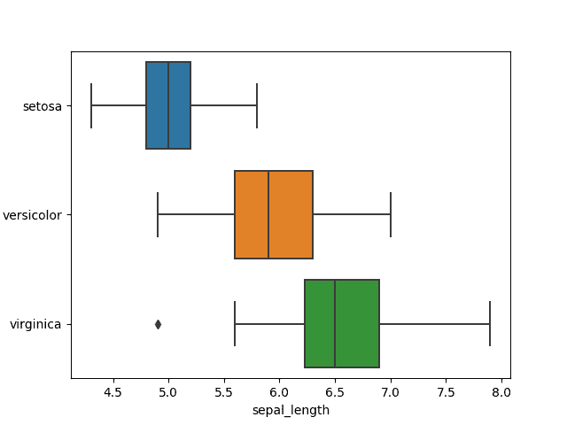
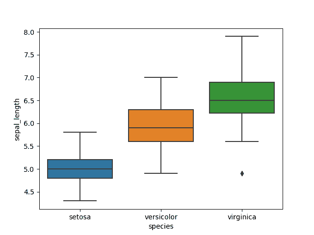
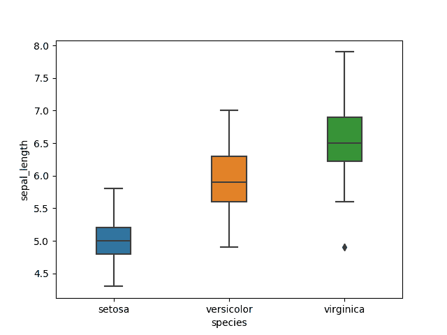

# Seaborn 箱形图

> 原文： [https://pythonbasics.org/seaborn_boxplot/](https://pythonbasics.org/seaborn_boxplot/)

Seaborn 箱形图是一个非常基本的图，箱形图用于可视化分布。
当您要比较两组之间的数据时，这很有用。

有时将箱形图称为箱须图。 任何框均显示数据集的四分位数，而晶须延伸以显示其余分布。


## 箱形图示例

### 箱形图

箱形图用`boxplot()`方法处理。 下面的示例加载鸢尾花数据集。 然后，所显示的箱形图显示了最小，最大，第一四分位数和第三四分位数。

```py

import seaborn as sns
import matplotlib.pyplot as plt

df = sns.load_dataset('iris')
df.head()

sns.boxplot( y=df["sepal_length"] );
plt.show()

```



### 水平箱形图

箱形图可以是水平图。 下例显示了水平方向的箱形图。我们再次使用鸢尾花数据集。 显示的颜色是默认颜色，但是它们是可配置的。

```py

import seaborn as sns
import matplotlib.pyplot as plt

df = sns.load_dataset('iris')
df.head()

sns.boxplot( y=df["species"], x=df["sepal_length"] );
plt.show()

```



### 箱形图颜色

箱形图颜色图颜色是可配置的。 您可以通过传递调色板参数来实现。 有各种各样的调色板，调色板`"Blues"`是各种各样的蓝色。

```py

import seaborn as sns
import matplotlib.pyplot as plt

df = sns.load_dataset('iris')
df.head()

sns.boxplot( x=df["species"], y=df["sepal_length"], palette="Blues");
plt.show()

```


### 多重箱形图

箱形图多重绘图以默认颜色显示法线方向上的集合。

```py

import seaborn as sns
import matplotlib.pyplot as plt

df = sns.load_dataset('iris')
df.head()

sns.boxplot( x=df["species"], y=df["sepal_length"] );
plt.show()

```



### 箱形图的大小

各个箱形图的大小可以通过`width`参数进行更改。 默认宽度为 1，因此任何较小的值都会为框创建较小的宽度。

```py

import seaborn as sns
import matplotlib.pyplot as plt

df = sns.load_dataset('iris')
df.head()

sns.boxplot( x=df["species"], y=df["sepal_length"], width=0.3);
plt.show()

```

