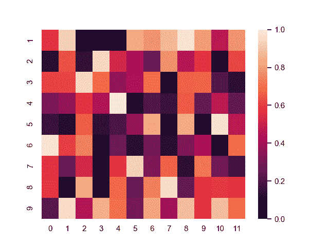
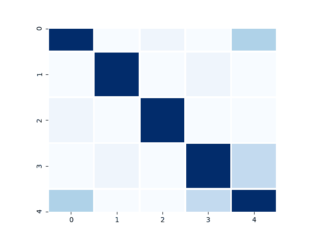
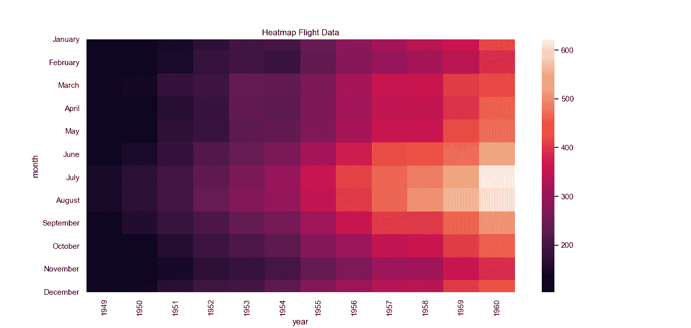

# Seaborn 热力图

> 原文： [https://pythonbasics.org/seaborn_heatmap/](https://pythonbasics.org/seaborn_heatmap/)

热力图是矩形数据作为颜色编码矩阵的曲线图。 作为参数，它采用 2D 数据集。 该数据集可以被强制为一个`ndarray`。

这是可视化数据的好方法，因为它可以显示包括时间在内的各种变量之间的关系。 例如，历年来的频率。


## 热力图示例

### 热力图

下面的热力图图基于 numpy 生成的随机值。 许多参数都是可能的，这只是显示了最基本的图。

```py
import pandas as pd
import numpy as np
import seaborn as sns
import matplotlib.pyplot as plt

np.random.seed(0)
sns.set()
uniform_data = np.random.rand(10, 12)
ax = sns.heatmap(uniform_data, vmin=0, vmax=1)
plt.show()

```



### 热力图颜色

下面的热力图颜色图再次使用了随机数据。 这次，它使用了不同的颜色图（`cmap`），带有“蓝色”调板，但仅是蓝色。 它还使用正方形块。

```py
import pandas as pd
import numpy as np
import seaborn as sns
import matplotlib.pyplot as plt

df = pd.DataFrame(np.random.randn(50).reshape(10,5))
corr = df.corr()

ax1 = sns.heatmap(corr, cbar=0, linewidths=2,vmax=1, vmin=0, square=True, cmap='Blues')
plt.show()

```



### 热力图数据

热力图数据图类似，但是使用不同的调色板。 它使用 Seaborn 中包含的航空公司或航班数据集。

```py
import pandas as pd
import numpy as np
import seaborn as sns
import matplotlib.pyplot as plt

sns.set()
flights = sns.load_dataset("flights")
flights = flights.pivot("month", "year", "passengers")
ax = sns.heatmap(flights)
plt.title("Heatmap Flight Data")
plt.show()

```

