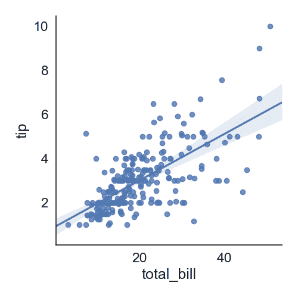
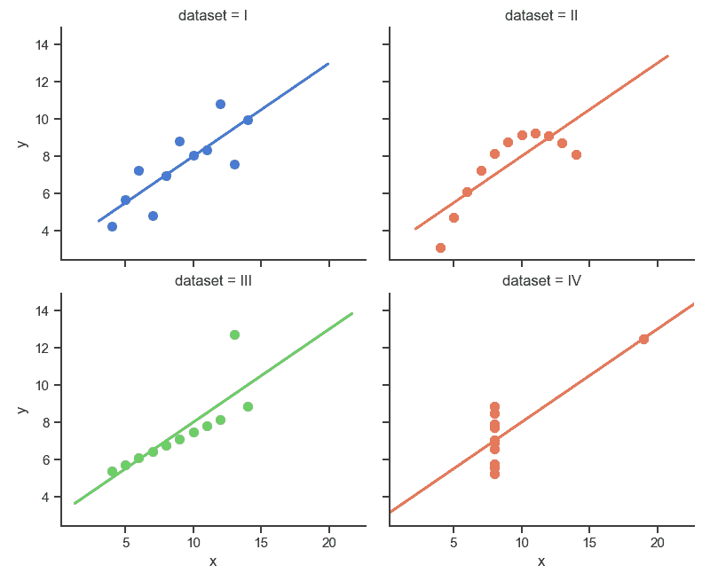

# Seaborn 直线图

> 原文： [https://pythonbasics.org/seaborn_line_plot/](https://pythonbasics.org/seaborn_line_plot/)

直线图（`lmplot`）是最基本的图之一。 它在二维平面上显示一条线。 您可以根据自己的喜好使用 Seaborn 或 Matlotlib 进行绘制。

下面的示例使用 Seaborn 创建图，但使用 Matplotlib 进行显示。 默认情况下，Seaborn 包括各种数据集，我们使用它们来绘制数据。


## 直线图

### `lmplot`

`lmplot`图显示了该线以及 2d 空间上的数据点。 通过指定`x`和`y`，可以分别设置水平和垂直标签。

```py
import seaborn as sns
import matplotlib.pyplot as plt

data=sns.load_dataset("tips")
data.head(5)

sns.set(font_scale=1.5,style="white")
sns.lmplot(x="total_bill",y="tip",data=data)
plt.show()

```



### 直线图

下图显示了不同类型的直线图。 它们可以是您想要的任何颜色。 我们使用了 Seaborn 中包含的数据集，但这可以用于任何类型的数据。

```py
import seaborn as sns
import matplotlib.pyplot as plt

sns.set(style="ticks")

# Load the example dataset for Anscombe's quartet
df = sns.load_dataset("anscombe")

# Show the results of a linear regression within each dataset
sns.lmplot(x="x", y="y", col="dataset", hue="dataset", data=df,
           col_wrap=2, ci=None, palette="muted", height=4,
           scatter_kws={"s": 50, "alpha": 1})

plt.show()

```

