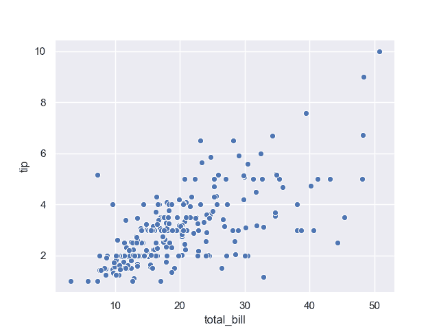
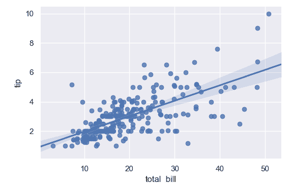

# Seaborn 散点图

> 原文： [https://pythonbasics.org/seaborn_scatterplot/](https://pythonbasics.org/seaborn_scatterplot/)

散点图是具有许多数据点的图。 这是 Seaborn 可以创造的众多土地之一。 Seaborn 是用于统计数据可视化的 Python 模块。

Seaborn 可以使用`scatterplot()`方法创建该图。 数据点与参数数据一起传递。 参数`x`和`y`是图的标签。


## 散点图

### 基本散点图

散点图基本图使用提示数据集。 这是有关基于总账单收到的提示的数据集。 您可以将所需的任何数据集用于散点图，这仅作为基本示例。

```py
import numpy as np
import pandas as pd
import matplotlib as mpl
import matplotlib.pyplot as plt
import seaborn as sns

tips = sns.load_dataset("tips")
sns.set(color_codes=True)
ax = sns.scatterplot(x="total_bill", y="tip", data=tips)
plt.show()

```



### 散点图

散点图也可以包含一条线。 为此，请改用`lmplot`。 这很好地显示了数据点之间的关系。

```py
import numpy as np
import pandas as pd
import matplotlib as mpl
import matplotlib.pyplot as plt
import seaborn as sns
sns.set(color_codes=True)
np.random.seed(sum(map(ord, "regression")))
tips = sns.load_dataset("tips")
tips.head()
sns.lmplot(x="total_bill", y="tip", data=tips)
plt.show()

```

