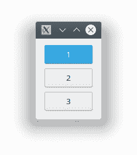

# PyQt

> 原文： [https://pythonbasics.org/pyqt/](https://pythonbasics.org/pyqt/)

PyQt 是使用 Python 制作桌面软件的模块。 这适用于所有台式机系统，包括 Mac OS X，Windows 和 Linux。

如果要使用 Python 制作桌面应用程序，PyQt 是制作它们的模块。 创建应用程序后，您可以使用 fbs 创建安装程序。

## 教程

### 什么是 PyQt？

PyQt 是 Qt 库（C++）的端口。 Qt 是一个非常强大的 GUI 库。 PyQt 不是单个模块，而是模块的集合。

这些模块包括：`QtCore`，`QtGui`，`QtWidgets`，`QtMultimedia`，`QtBluetooth`，`QtNetwork`，`QtPositioning`，`Enginio`，`QtWebSockets`，`QtWebKit`，`QtWebKitWidgets`，`QtXml`，`QtSvg`，`QtSql` 和 `QtTest`。

那么这些模块中有什么？

*   `QtCore`：包含核心非 GUI 代码。

*   `QtGui`：具有用于窗口管理的所有内容，例如事件处理和图形。

*   `QtWidgets`：具有许多 UI 窗口小部件，例如按钮，标签，文本输入以及您在桌面窗口中看到的其他内容。

*   `QtMultimedia`：用于多媒体内容和摄像机。

*   `QtBluetooth`：扫描蓝牙设备并连接。

*   `QtNetwork`：一种用于网络编程的跨平台解决方案。 设置可在所有桌面系统上运行的套接字服务器或客户端。 同时支持 TCP/IP 栈和 UDP。

*   `QtPositioning`：通过使用位置（WiFi，卫星）确定位置

*   `QtWebSockets`：Websocket 协议的实现。

*   `QtWebKit`：Web 浏览器实现。 您可以使用它来呈现网页。 这是基于 WebKit2 的。 在 Safari 浏览器中，KDE 和其他人使用 WebKit。

*   `QtWebKitWidgets`：已弃用。 WebKit1 版本的 Web 浏览器实现

*   `QtXml`：使用 XML 文件，读/写等。

*   `QtSvg`：可缩放矢量图形（SVG）。一种图像格式。

*   `QtSql`：与数据库一起使用。

*   `QtTest`：单元测试

### 安装 PyQt

您可以使用 PyQt 轻松制作桌面软件。 有两种安装 PyQt 的方法：使用安装程序和来自代码。

从源代码编译 PyQt 可能是一个繁琐的过程，建议您使用安装程序或软件包管理器进行安装。 （最终用户只需运行安装程序即可安装软件）

您可以查看[有关 PyQt 安装](/install-pyqt/)的教程。

### 创建应用

安装 PyQt 之后，您可以创建各种桌面软件。 PyQt 有许多小部件，包括按钮，输入字段，组合框，Web 视图和其他许多小部件。

这很简单，您将在接下来的教程中学习如何做到这一点。

