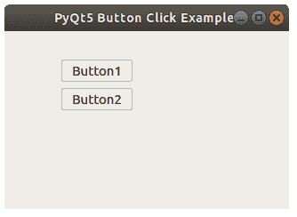

# PyQt 按钮

> 原文： [https://pythonbasics.org/PyQt-buttons/](https://pythonbasics.org/PyQt-buttons/)

按钮（`QPushButton`）可以添加到任何窗口。`QPushButton`类具有用于标签的`setText()`方法和用于位置的`move(x, y)`方法。

在本文中，您可以看到如何将按钮添加到窗口以及如何将方法连接到窗口。


## PyQt 按钮示例

### 信号和槽

您可以使用几行代码创建一个按钮：

```py
button1 = QPushButton(widget)
button1.setText("Button1")
button1.move(64,32)

```

然后将其连接到以下方法：

```py
button1.clicked.connect(button1_clicked)

```

接收方法称为槽，`clicked.connect`（如果单击了按钮）称为信号。

```py
def button1_clicked():
   print("Button 1 clicked")

```



### 按钮示例

运行下面的代码以查看一个窗口中的 2 个按钮。 您可以单击任意一个按钮，它们的连接方法将被调用。

```py
import sys
from PyQt5.QtWidgets import QApplication, QWidget, QPushButton
from PyQt5.QtGui import QIcon
from PyQt5.QtCore import pyqtSlot

def window():
   app = QApplication(sys.argv)
   widget = QWidget()

   button1 = QPushButton(widget)
   button1.setText("Button1")
   button1.move(64,32)
   button1.clicked.connect(button1_clicked)

   button2 = QPushButton(widget)
   button2.setText("Button2")
   button2.move(64,64)
   button2.clicked.connect(button2_clicked)

   widget.setGeometry(50,50,320,200)
   widget.setWindowTitle("PyQt5 Button Click Example")
   widget.show()
   sys.exit(app.exec_())

def button1_clicked():
   print("Button 1 clicked")

def button2_clicked():
   print("Button 2 clicked")   

if __name__ == '__main__':
   window()

```

[下载示例](https://gum.co/pysqtsamples)