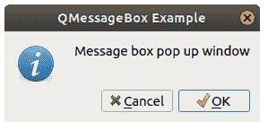

# PyQt `QMessageBox`

> 原文： [https://pythonbasics.org/PyQt-QMessageBox/](https://pythonbasics.org/PyQt-QMessageBox/)

PyQt `QMessageBox`，您可以用来创建对话框。 这是一个经常在桌面上看到的弹出窗口。

它可能是单行消息，“确定要保存吗？”消息或更高级的消息。

该消息框支持各种变体和按钮。 在本课程中，您将学习如何创建信息对话框窗口。


## 对话框

### 初始窗口

创建一个带有按钮的窗口。 如果单击按钮，将弹出对话框。

（这也是 PyQt 初始化的地方。）

```py
def window():
   app = QApplication(sys.argv)
   win = QWidget()
   button1 = QPushButton(win)
   button1.setText("Show dialog!")
   button1.move(50,50)
   button1.clicked.connect(showDialog)
   win.setWindowTitle("Click button")
   win.show()
   sys.exit(app.exec_())

```

因此，让我们看一下`showDialog()`。

### 创建一个对话框

使用`QMessageBox()`创建一个对话框。 不要忘记从 PyQt5 导入它。

```py
from PyQt5.QtWidgets import QPushButton

```

然后使用方法`setIcon()`，`setText()`，`setWindowTitle()`设置窗口装饰。

您可以使用`setStandardButtons()`配置对话框按钮。

```py
def showDialog():
   msgBox = QMessageBox()
   msgBox.setIcon(QMessageBox.Information)
   msgBox.setText("Message box pop up window")
   msgBox.setWindowTitle("QMessageBox Example")
   msgBox.setStandardButtons(QMessageBox.Ok | QMessageBox.Cancel)
   msgBox.buttonClicked.connect(msgButtonClick)

   returnValue = msgBox.exec()
   if returnValue == QMessageBox.Ok:
      print('OK clicked')

```



### 可下载的代码

您可以将以下代码复制并粘贴到自己的计算机上，以测试其工作方式。

```py
import sys
from PyQt5.QtWidgets import QApplication, QWidget, QPushButton, QMessageBox
from PyQt5.QtGui import QIcon
from PyQt5.QtCore import pyqtSlot

def window():
   app = QApplication(sys.argv)
   win = QWidget()
   button1 = QPushButton(win)
   button1.setText("Show dialog!")
   button1.move(50,50)
   button1.clicked.connect(showDialog)
   win.setWindowTitle("Click button")
   win.show()
   sys.exit(app.exec_())

def showDialog():
   msgBox = QMessageBox()
   msgBox.setIcon(QMessageBox.Information)
   msgBox.setText("Message box pop up window")
   msgBox.setWindowTitle("QMessageBox Example")
   msgBox.setStandardButtons(QMessageBox.Ok | QMessageBox.Cancel)
   msgBox.buttonClicked.connect(msgButtonClick)

   returnValue = msgBox.exec()
   if returnValue == QMessageBox.Ok:
      print('OK clicked')

def msgButtonClick(i):
   print("Button clicked is:",i.text())

if __name__ == '__main__': 
   window()

```

[下载示例](https://gum.co/pysqtsamples)