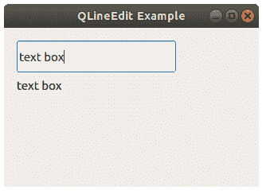

# `QLineEdit`

> 原文： [https://pythonbasics.org/QLineEdit/](https://pythonbasics.org/QLineEdit/)

您可以使用`QLineEdit`小部件获得用户输入。 在本课程中，您将进行行编辑，以在运行时更改标签文本。

一个窗口可以包含一个或多个`QLineEdit`小部件。 它们本身不包含标签，出于 UX 的目的，您可能希望向`QLineEdit`添加标签以告诉用户在框中键入什么内容。


## `QLineEdit`

### 添加输入框

下面的面向对象的代码使用构造函数创建一个窗口。 将输入框或行编辑添加到窗口，这称为`QLineEdit`。

然后添加标签和行编辑：

```py
self.lineEntry = QLineEdit(self)
self.lineEntry.move(16,16)
self.lineEntry.resize(200,40)

self.qlabel = QLabel(self)
self.qlabel.move(16,64)

```

您可以使用方法调用连接输入框中的每个按键（`QLineEdit`）。

```py
self.lineEntry.textChanged.connect(self.onChanged)

```

在该方法中，设置标签文本并调整标签大小。

```py
def onChanged(self, text):
    self.qlabel.setText(text)
    self.qlabel.adjustSize()

```



### 示例

复制并粘贴以下示例代码，自己尝试：

```py
import sys
from PyQt5.QtWidgets import QApplication, QMainWindow, QLabel, QLineEdit, QPushButton

class Example(QMainWindow):

    def __init__(self):
        super().__init__()

        self.lineEntry = QLineEdit(self)
        self.lineEntry.move(16,16)
        self.lineEntry.resize(200,40)

        self.qlabel = QLabel(self)
        self.qlabel.move(16,64)

        self.lineEntry.textChanged.connect(self.onChanged)

        self.setGeometry(50,50,320,200)
        self.setWindowTitle("QLineEdit Example")
        self.show()

    def onChanged(self, text):
        self.qlabel.setText(text)
        self.qlabel.adjustSize()

if __name__ == '__main__':
    app = QApplication(sys.argv)
    ex = Example()
    sys.exit(app.exec_())

```

[下载示例](https://gum.co/pysqtsamples)