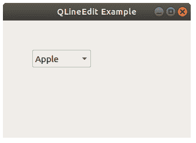

# PyQt 组合框

> 原文： [https://pythonbasics.org/PyQt-combobox/](https://pythonbasics.org/PyQt-combobox/)

您可以具有`QComboBox`的组合框，选择框或组合框。 要使用此小部件，请从`PyQt5.QtWidgets`导入`QComboBox`。

通常，当用户需要从选定数量的项目（例如国家/地区或合同）中进行选择时，您会看到此小部件。


## `QComboBox`

### 创建一个组合框

您可以使用以下几行创建一个组合框：

```py
combo = QComboBox(self)
combo.addItem("Apple")

```

方法`addItem`将一个选项添加到组合框中。 您可以根据需要使用不同的选项多次呼叫。

要将组合框更改与方法联系起来，可以使用以下方法：

```py
combo.activated[str].connect(self.onChanged)      

```



### 示例

下面的代码将组合框添加到窗口。 选择组合框中显示的选项之一后，标签值将更改。

```py
import sys
from PyQt5.QtWidgets import QApplication, QMainWindow, QLabel, QComboBox, QPushButton

class Example(QMainWindow):

    def __init__(self):
        super().__init__()

        combo = QComboBox(self)
        combo.addItem("Apple")
        combo.addItem("Pear")
        combo.addItem("Lemon")

        combo.move(50, 50)

        self.qlabel = QLabel(self)
        self.qlabel.move(50,16)

        combo.activated[str].connect(self.onChanged)      

        self.setGeometry(50,50,320,200)
        self.setWindowTitle("QLineEdit Example")
        self.show()

    def onChanged(self, text):
        self.qlabel.setText(text)
        self.qlabel.adjustSize()

if __name__ == '__main__':
    app = QApplication(sys.argv)
    ex = Example()
    sys.exit(app.exec_())

```

[下载示例](https://gum.co/pysqtsamples)