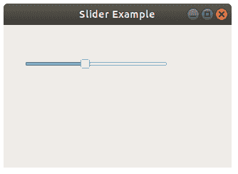

# `QSlider`

> 原文： [https://pythonbasics.org/QSlider/](https://pythonbasics.org/QSlider/)

PyQt 带有滑块`QSlider`。 您可以使用此滑块选择一个值。 滑块可以作为音量的绝佳输入控件。

与数字计数器相比，它允许用户快速更改小部件范围上的值。`QSlider`的范围是 0 到 100，其中 100 是 100% 。


## `QSlider`

### 创建滑块

滑块可以是水平或垂直的。 创建滑块时，可以选择一种类型。`Qt.Horizo​​ntal`或`Qt.Vertical`。

首先导入`QSlider`和`Qt`。

```py
from PyQt5.QtCore import Qt
from PyQt5.QtWidgets import QSlider

```

然后创建一个滑块：

```py
mySlider = QSlider(Qt.Horizontal, self)

```

然后设置其几何形状（位置和大小）：

```py
mySlider.setGeometry(30, 40, 200, 30)

```

并连接一个在更改其值时调用的方法：

```py
mySlider.valueChanged[int].connect(self.changeValue)

```



### 示例

下面的程序创建一个带有水平滑块的空窗口。 如果您想使用垂直滑块，请不要忘记更改几何形状。

复制并粘贴以下代码以尝试使用滑块：

```py
import sys
from PyQt5.QtWidgets import QApplication, QMainWindow, QSlider
from PyQt5.QtCore import Qt

class Example(QMainWindow):

    def __init__(self):
        super().__init__()

        mySlider = QSlider(Qt.Horizontal, self)
        mySlider.setGeometry(30, 40, 200, 30)
        mySlider.valueChanged[int].connect(self.changeValue)

        self.setGeometry(50,50,320,200)
        self.setWindowTitle("Checkbox Example")
        self.show()

    def changeValue(self, value):
        print(value)

if __name__ == '__main__':
    app = QApplication(sys.argv)
    ex = Example()
    sys.exit(app.exec_())

```

[下载示例](https://gum.co/pysqtsamples)